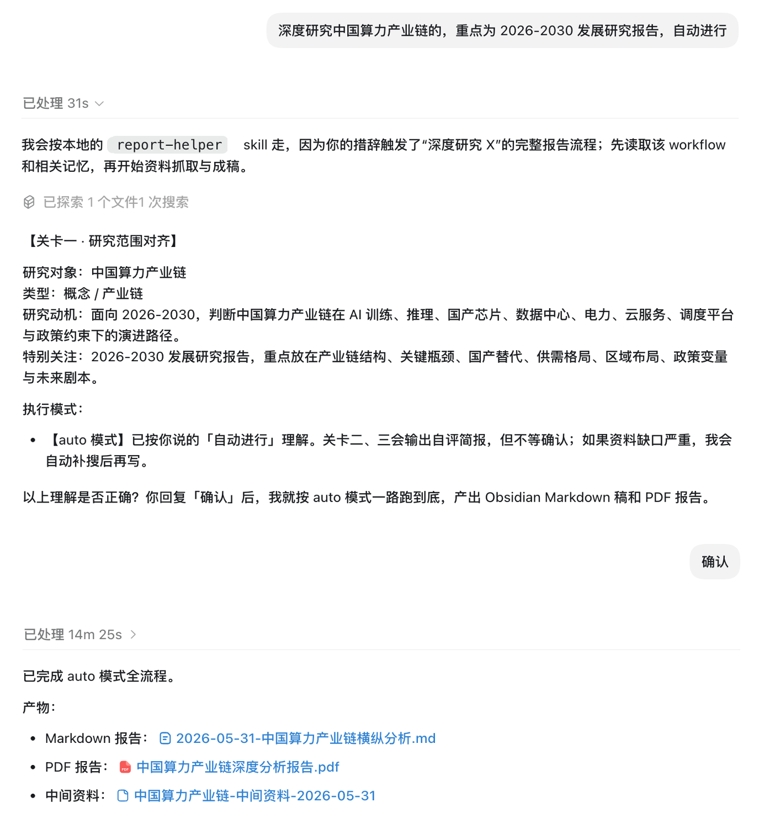
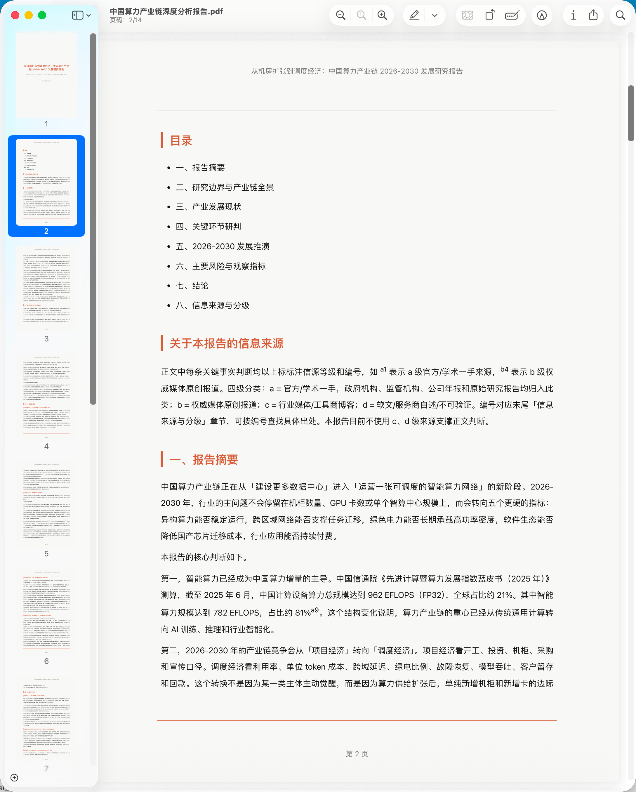

# report-helper · One-Sentence Deep Research Reports


[中文 README](./README.md) · [Quick Start](#quick-start) · [Example PDF](./examples/中国算力产业链深度分析报告.pdf) · [Issues](https://github.com/Jiaranbb/report-helper/issues) · [Support](./SUPPORT.md)

**Author / Contact**: 嘉然 Jiaran · WeChat official account: **嘉然学习笔记** · WeChat: `evadebot`

`report-helper` is an AI Skill for long-form research report writing. Given a research topic, it guides an agent through source collection, source quality review, evidence organization, thesis formation, editorial review, and polished PDF generation.

> From one sentence to a shareable PDF report: sourced, reasoned, and formatted.

It is designed for research on products, companies, people, concepts, value chains, policies, and trends. The goal is not to write a short summary, but to run a fuller research-writing workflow with traceable sources, explicit judgments, and a formal deliverable.

## Quick Start

Send this to Codex, Claude Code, OpenClaw, or another skill-capable agent:

```text
Install the report-helper skill from https://github.com/Jiaranbb/report-helper. After installation, remind me to restart or refresh the current agent as required; after restart, run python3 scripts/check_environment.py to check the environment.
```

If your environment supports the `skills` CLI:

```bash
npx skills add https://github.com/Jiaranbb/report-helper --skill report-helper
```

Codex users can also install manually:

```bash
python3 ~/.codex/skills/.system/skill-installer/scripts/install-skill-from-github.py \
  --repo Jiaranbb/report-helper \
  --path . \
  --name report-helper
```

Restart or refresh the current agent as required after installation.

## Highlights

- 🧭 **One-sentence start**: provide a topic and focus; the agent runs the full report workflow.
- 🔎 **Research before writing**: the workflow requires current data checks before drafting.
- 🧾 **Traceable sources**: key factual claims are marked with citation IDs such as `<sup>a1</sup>`.
- 📊 **Qualitative + quantitative**: company reports must include growth, earnings quality, cash flow, financing, valuation, or comparable-company analysis where data is available.
- 🎨 **Designed PDF output**: background color, typography, spacing, headings, and footer styling are tuned for sharing.

## Preview

The example below was generated with Codex GPT-5.5 standard speed in about 15 minutes. Quality and runtime depend on model capability, source availability, web-search quality, and topic complexity.

Run example:



PDF preview:



Example report: [`中国算力产业链深度分析报告.pdf`](examples/中国算力产业链深度分析报告.pdf)

## Example Prompts

```text
Deeply research China's compute infrastructure value chain, focusing on 2026-2030 development trends, and run automatically.

Deeply research a company, focusing on business model, growth potential, valuation logic, and risk.

Write an AI compute industry development research report.
```

## Suitable / Not Suitable

**Suitable for**

- Long-form research on products, companies, people, concepts, value chains, policies, and trends
- Reports requiring public sources, evidence chains, and source grading
- Research tasks that need a formal PDF deliverable
- Multi-agent "peer review" for important topics
- Company and industry research that should combine narrative judgment with quantitative indicators

**Not suitable for**

- Short definitions, quick summaries, or generic Q&A
- Lightweight writing that does not need web research or source review
- Final professional decisions in finance, law, medicine, or other regulated domains
- Precise conclusions unsupported by public or user-provided data
- Workflows that only want editable Markdown as the final deliverable

## Workflow

`report-helper` follows a 7-step workflow:

1. **Scope alignment**: confirm topic, type, motivation, focus, and execution mode.
2. **Source collection**: prioritize current official, regulatory, filing, primary research, and authoritative media sources.
3. **Sufficiency audit**: identify missing evidence; search again when gaps are severe.
4. **Judgment formation**: organize key claims, evidence chains, and counterarguments.
5. **Drafting**: select the right report structure; add quantitative analysis for company reports.
6. **Review loop**: check facts, sources, structure, tone, and PDF delivery.
7. **Delivery**: generate the PDF and keep intermediate notes and logs where configured.

## First Run

Check the environment:

```bash
python3 scripts/check_environment.py
```

Install PDF rendering dependencies if needed:

```bash
python3 -m pip install markdown weasyprint
```

Copy `config.example.json` to `config.local.json`:

```json
{
  "output_dir": "./output",
  "work_dir": "./output/work",
  "intermediate_dir": "./output/intermediate",
  "author": "Your Name or Organization"
}
```

## Quality Notice

Report quality depends heavily on model capability. Codex GPT-5.5 is recommended for best results.

AI-generated reports can still be wrong, including drawing incorrect conclusions from correct facts. Treat outputs as learning references, and use "peer review" between multiple AI agents to challenge assumptions, ask hard questions, and verify reasoning.

## Author & Support

**嘉然 Jiaran**

- WeChat official account: **嘉然学习笔记**
- WeChat: `evadebot`
- GitHub: https://github.com/Jiaranbb/report-helper
- Support: [SUPPORT.md](./SUPPORT.md)
- Issues: https://github.com/Jiaranbb/report-helper/issues

## License

MIT License. See [LICENSE](LICENSE).
